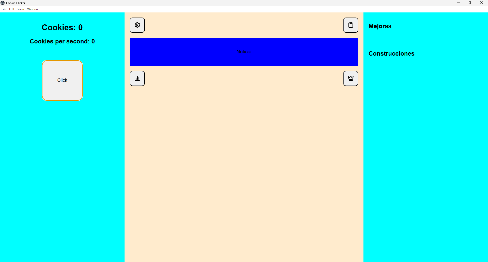

# 🍪 Cookie Clicker – Idle Game (Custom Build)


An **idle game inspired by the original [Cookie Clicker](https://cookieclicker.com/) by Orteil**.
Built from scratch as a personal project to explore **game development, UI design, and incremental systems**.

---

## 🎮 Preview

> 📸 _Add screenshots here when available_

```md id="shot1"

```

```md id="shot2"

```

---

## ⚡ Current Features

✔ Cookie click system (manual production)
✔ CPS (cookies per second) system
✔ Game-like 3-column layout UI
✔ Interactive HUD buttons
✔ Basic shop system (upgrades + buildings structure)
✔ Web + Electron compatibility

---

## 🧠 Gameplay Loop

```text id="loop1"
Click → Gain Cookies → Buy Upgrades → Increase CPS → Progress Faster
```

---

## 🏗️ Tech Stack

- HTML5 (UI structure)
- CSS3 (Flexbox game layout)
- JavaScript (game logic)
- Electron (desktop build)

---

## 🚀 Installation

### 🌐 Web Version

```bash id="runweb"
open index.html
```

---

### 💻 Desktop Version (Electron)

```bash id="runelectron"
npm install
npm start
```

---

## 📊 Roadmap

### 🟢 Phase 1 – Core (DONE / IN PROGRESS)

- [x] Base UI layout
- [x] Click system
- [x] CPS system
- [x] Basic shop structure

---

### 🟡 Phase 2 – Gameplay Expansion

- [ ] Upgrade system (scaling costs)
- [ ] Buildings (automatic production)
- [ ] Save system (localStorage)
- [ ] Prestige / rebirth system

---

### 🔵 Phase 3 – Polish

- [ ] Animations (click feedback, bounce, shake)
- [ ] Particle effects (+1 cookies visuals)
- [ ] Sound effects
- [ ] UI polish (hover glow, transitions)

---

### 🟣 Phase 4 – Content Expansion

- [ ] More upgrades & buildings
- [ ] Events / news system
- [ ] Achievements system
- [ ] Game balance tuning

---

## 🎯 Design Goals

- Simple but addictive idle gameplay loop
- Clean UI inspired by modern incremental games
- Fully playable in both browser and desktop (Electron)
- Easy to expand and maintain architecture

---

## 🖼️ UI Concept

> 🧪 Minimal idle game layout design:

- Left → Gameplay (click + stats)
- Center → HUD / controls / events
- Right → Shop (upgrades + buildings)

---

## 📦 Project Structure

```text id="struct1"
cookie-clicker/
│
├── .gitignore
├── main.js (Electron entry)
├── package.json
├── package-lock.json
├── README.md
└── src/
    ├── index.html
    ├── script.js
    ├── styles.css
    └── assets/
```

---

## 🧪 Current Status

> 🟡 Early development stage
> Core systems are implemented. Gameplay loop is currently being expanded.

---

## 💡 Vision

This project combines:

- Idle game design principles
- UI/UX experimentation
- Incremental progression systems
- Electron desktop deployment

The goal is to build a **simple but polished incremental game from scratch**.

---

## 📄 License

Personal / educational project. Free to study and modify.

---
